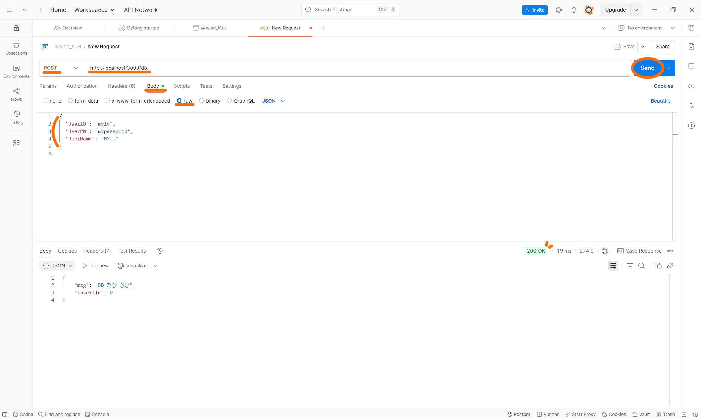

# 🦁 DB 실습 과제

간단한 DB 실습을 통해 데이터베이스 제작, MySQL 연동, POSTMAN 테스트, 그리고 웹 서버를 통한 데이터 확인까지 진행한 기록입니다.

 

## 📂 1. 새 DB 생성

MYSQL에서 새 데이터베이스를 생성하는 과정입니다.

| Step 1 | Step 2 | Step 3 | Step 4 |
|:------:|:------:|:------:|:------:|
|||||

 

## 👾 2. user 테이블 생성 및 데이터 추가

### 테이블 생성

사용자 정보를 저장할 `user` 테이블을 생성합니다.

| Step 1 | Step 2 | Step 3 | Step 4 |
|:------:|:------:|:------:|:------:|
|||||

### 데이터 추가

`user` 테이블에 ID와 PW 데이터를 삽입합니다.

| Step 1 | Step 2 | Step 3 |
|:------:|:------:|:------:|
||||

 

## 📮 3. POST 요청 처리

POSTMAN을 사용하여 POST 요청을 보냈을 때, `app.post()`를 통해 전달받은 UserID, UserPW, UserName이 데이터베이스에 저장되도록 했습니다.

| POSTMAN 테스트 |
|:--------------:|
||

 

## 🌐 4. 웹에서 데이터 확인

브라우저를 통해 `localhost:3000/db`에 접속하여 사용자 데이터를 확인합니다.

| POST 요청 전 | POST 요청 후 |
|:---------------:|:--------------:|
|||

  

## 📝 후기

직접 손으로 따라 하면서 프로젝트의 흐름을 몸으로 익힐 수 있었다. 특히, **서버 생성 → 라우팅 설정 → DB 연동 → 요청 처리**의 구조를 이해하는 데 도움이 되었고, 아직 완벽하진 않지만 **내가 원하는 프로젝트를 만들어 나갈 수 있겠다는 자신감**이 조금 생겼다. 앞으로 이 경험을 바탕으로 더 발전해서 실제 프로젝트에 멋지게 적용해보고 싶다!
